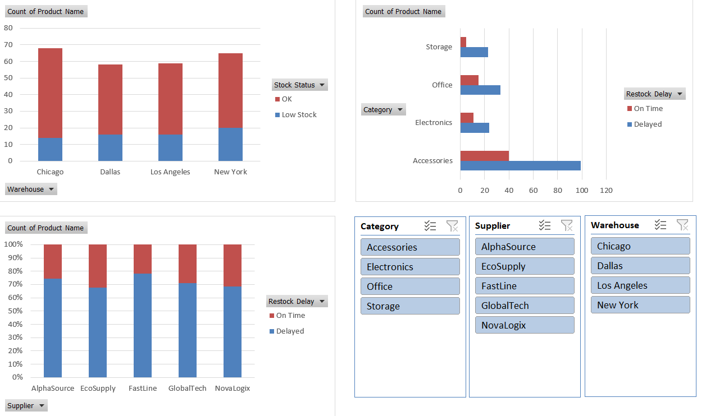

# Supply Chain Inventory Tracker Dashboard

📦 **Project Type**: Supply Chain Analytics  
🛠 **Tools Used**: Excel, PivotTables, Charts, Slicers  
🎯 **Business Goal**: Improve inventory visibility and reduce restocking delays.

---

## 🔍 Overview  
Built a supply chain dashboard to monitor inventory status across multiple warehouses and suppliers. Visualized stock levels and restocking delays using interactive pivot charts and slicers.

---

## 🎯 Objective  
Help supply chain managers identify stock shortages and supplier-related restocking delays to ensure smoother inventory operations.

---

## 📊 Key Insights
- Low-stock item counts are relatively low across all warehouses, with **New York** having the highest (**20 out of 65**) and **Chicago** the lowest (**14 out of 68**). This may reflect differences in fulfillment patterns or product turnover rates rather than critical shortages.
- **FastLine** and **AlphaSource** have the highest restocking delays, with **78.3%** and **74.4%** of their orders arriving late, respectively — highlighting a need for closer supplier management.
- The **Accessories** category experiences the most delays, with **99 delayed restocks**, suggesting recurring challenges in that product line’s supply chain.
- Dashboard filters allow targeted analysis by **warehouse**, **supplier**, and **category**, making it easier to pinpoint issues and support timely decision-making.

  

---

## ✅ Recommendations

- Monitor restocking trends across warehouses and adjust ordering frequency as needed to maintain consistent stock availability without overordering.
- Engage with underperforming suppliers like **FastLine** and **AlphaSource** to address delay patterns, and evaluate alternative vendors if improvements aren’t made.
- Investigate systemic issues in the **Accessories** supply chain — such as demand forecasting errors, vendor constraints, or logistics delays — to reduce future disruptions.
- Use this dashboard routinely to catch early signals of inventory stress and take preventive action before stockouts occur.

---

